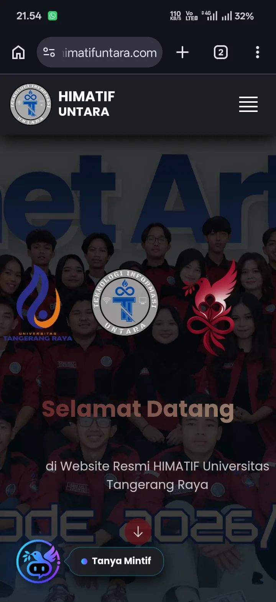
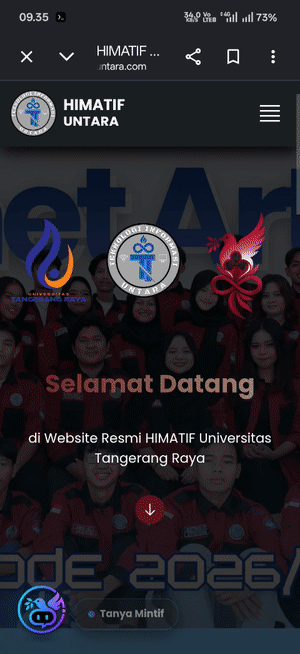
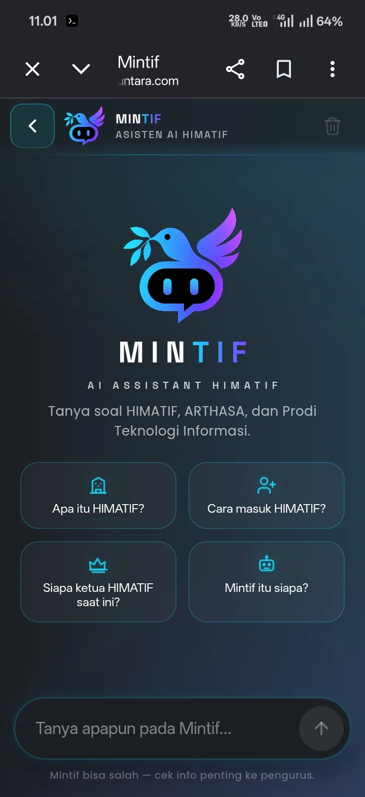
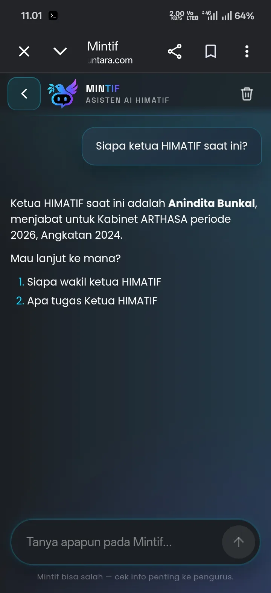

# Mintif

<p align="center">
  
</p>

<p align="center">
  <strong>Teman AI-mu Soal HIMATIF</strong><br>
  Chatbot asisten HIMATIF dengan RAG, dibangun sepenuhnya di Android.
</p>

<p align="center">
  
  
  
  
  
</p>

---

## Daftar Isi

- [Tentang Mintif](#tentang-mintif)
- [Tampilan](#tampilan)
- [Fitur](#fitur)
- [Cara Kerja](#cara-kerja)
- [Tech Stack](#tech-stack)
- [Struktur Project](#struktur-project)
- [Instalasi & Menjalankan](#instalasi--menjalankan)
- [Environment Variables](#environment-variables)
- [Data Knowledge](#data-knowledge)
- [Daftar Route API](#daftar-route-api)
- [Pantau & Monitoring](#pantau--monitoring)
- [Deploy Produksi](#deploy-produksi)
- [Dikembangkan di Android](#dikembangkan-di-android)
- [Testing](#testing)
- [Rencana Lanjut](#rencana-lanjut)
- [Author](#author)

---

## Tentang Mintif

**Mintif** (Min = sapaan akrab Admin, TIF = Teknologi Informasi) adalah chatbot asisten resmi HIMATIF, Himpunan Mahasiswa Teknologi Informasi Universitas Tangerang Raya, Kabinet ARTHASA 2026. Panggil saja dia **Mimin**: ramah, akrab, dan gaul kayak admin betulan.

Konsepnya pakai **RAG (Retrieval-Augmented Generation)**: dokumen resmi HIMATIF dalam bentuk PDF dipecah jadi potongan kecil (chunk) per bab, diubah jadi embedding, lalu dicari secara semantik sebelum model AI menyusun jawaban. Jadi jawabannya berbasis data, bukan ngarang.

Ruang lingkup Mimin:

- **Fakta HIMATIF** (sejarah, struktur, kegiatan, kepengurusan ARTHASA): hanya dari knowledge.
- **Data dosen TI** (nama, gelar, nomor kontak), nomor dosen boleh dijawab langsung kalau ditanya, itu memang gunanya data ini.
- **Sapaan & basa-basi**: dijawab singkat dan hangat.
- **Di luar itu** (ilmu umum, MTK, resep, bola, kode, presiden): ditolak halus 1 kalimat, diarahkan balik ke topik HIMATIF.

Setiap pengguna punya riwayat chat sendiri yang terisolasi (per `user_id`), jadi tidak saling bocor.

---

## Tampilan

| Web HIMATIF + FAB | Transisi Circle Reveal | Welcome Chatbot |
|---|---|---|
|  |  |  |

| Chat: Jawaban Materi |
|---|
|  |

Alurnya: klik FAB **Tanya Mintif** di web HIMATIF → lingkaran menutup → halaman chatbot terbuka → lingkaran membuka. Simetris dua arah, tombol back di chat maupun tombol back HP sama-sama memutar animasi balik ke web.

---

## Fitur

- **RAG per-bab**: 23 chunk dari 4 PDF resmi, jawaban nempel makna data.
- **Pencarian semantik**: FAISS `IndexIDMap` + cosine similarity, threshold `0.55`, `top_k=15`.
- **Normalisasi singkatan**: kahim, wakahim, sekum, bendum, kadep, dan imbuhan (`-nya/-ku/-mu`) dikenali sebelum embedding.
- **Kepribadian Mimin**: mirror gaya bahasa user (gaul ↔ formal), format jawaban fleksibel (paragraf/poin/kombinasi), markdown dibatasi biar rapi di HP.
- **Follow-up 2 saran**: tiap jawaban materi ditutup 2 topik lanjutan dari knowledge.
- **Streaming (SSE)**: jawaban mengalir token-per-token lewat `POST /api/chat/stream`, plus mode non-stream biasa.
- **Audit per-turn**: tabel `chat_audit` mencatat tiap pertanyaan: `user_id`, IP, endpoint, `hit_knowledge`, latensi, error, dan alasan miss (`oot`/`gatau`/`chit`).
- **Rate limit**: `15/menit; 200/jam` per API, kuncinya ikut `user_id` biar maba di NAT kampus (satu IP rame-rame) tidak saling makan jatah.
- **Batas pesan 500 karakter**: kepanjangan ditolak halus (413) biar hemat token.
- **Sanitasi deterministik**: markdown berat (tabel pipa, code block, `---`, emoji) dilucuti sebelum disimpan dan saat streaming.
- **Riwayat per-user**: tiap browser punya history sendiri (6 pesan terakhir dipakai sebagai konteks LLM), bisa dihapus kapan saja tanpa menyentuh audit.
- **Sensor privasi**: atribut sensitif (NIM, ultah, sosmed, alamat) hanya keluar kalau user eksplisit menanyakannya.
- **Transisi circle GPU**: animasi pakai `transform: scale()`, mulus di HP kentang.
- **Responsif**: nyaman di HP maupun laptop.
- **Production-ready**: gunicorn + endpoint `/health` buat watcher/monitor.

---

## Cara Kerja

```
PDF -> clean_text -> chunking per bab (heading bernomor + sub-split)
                       |
                       v
            SQLite (chunk + sumber)      FAISS index (embedding Jina)
                       |                              ^
                       |                              |
                       +-----> query -> embedding ----+
                                |
                 context + riwayat (6 pesan) |
                                v
               system prompt -> 9router/Groq -> jawaban Mimin
                                |
                                v
                    petik tag -> audit (chat_audit)
```

1. **Ingestion**: PDF dibaca (pypdf), dibersihkan (dedup header tabel, perbaikan artefak spasi ekstraksi, em-dash jadi hyphen), lalu dipecah per bab mengikuti heading bernomor. Bab yang panjang dipecah lagi per sub-bagian. Hasil saat ini: **23 chunk**.
2. **Indexing**: tiap chunk di-embedding pakai Jina (`jina-embeddings-v5-text-small`, 1024 dimensi), disimpan di SQLite, dan vektornya masuk index FAISS. `IndexIDMap` menjaga id FAISS sinkron dengan id SQLite. Tulis index atomik (`knowledge.index.tmp` → `knowledge.index`).
3. **Query**: pertanyaan user dinormalisasi dulu (singkatan → istilah knowledge), di-embedding (LRU cache 512), lalu dicari dengan cosine similarity (`top_k=15`, lolos kalau skor ≥ `0.55`). Chunk yang lolos digabung jadi context, label internal `[Bab X]` dicopot biar Mimin tidak mengutip struktur dokumen ke user.
4. **Generation**: context + 6 pesan riwayat terakhir + system prompt (~4,5rb karakter) dikirim ke LLM lewat 9router (fallback otomatis) atau langsung ke Groq. Jawaban ditutup 1 tag sistem (`[OK]`/`[GATAU]`/`[OOT]`/`[CHIT]`) yang dicopot sebelum tampil ke user tapi dicatat ke audit.

---

## Tech Stack

| Lapisan | Teknologi |
|---|---|
| Backend | Python 3.10, Flask 3.1.3, gunicorn 23 (produksi), waitress 3.0.2 |
| RAG / Vektor | faiss-cpu 1.14.3 (`IndexIDMap` + `IndexFlatIP`, cosine), numpy 2.2.6 |
| Penyimpanan | SQLite (WAL): tabel `history`, `knowledge`, `chat_audit` |
| Embedding | Jina AI `jina-embeddings-v5-text-small` (1024-d) |
| LLM | 9router `GPT-120B-Fallback` (fallback otomatis) / Groq `openai/gpt-oss-120b` via SDK OpenAI-compatible |
| PDF | pypdf 6.14.2 |
| Frontend | Vanilla JS + CSS (`home` + `chatbot`), integrasi FAB + circle reveal ke web HIMATIF (Vue, repo terpisah) |
| Rate limit | flask-limiter 4.1.1 (`memory://`) |

---

## Struktur Project

```
mintif/
├── app.py               # Entry Flask: routes, rate limit, session, audit, SSE
├── ai.py                # Klien LLM (9router/Groq via SDK OpenAI) + sanitasi markdown
├── chatbot.py           # RAG: normalisasi alias, retrieval FAISS, rakit prompt
├── prompt.py            # System prompt Mimin (identitas, scope, gaya flat, few-shot)
├── rag.py               # Ingestion PDF: clean, chunk per bab, embed, simpan
├── embedding.py         # Klien embedding Jina (LRU cache 512)
├── vector_db.py         # Index FAISS (cosine) + rebuild + atomic write
├── database.py          # Lapisan SQLite (history, knowledge, audit + migrasi)
├── history.py           # Helper riwayat per-user (truncate khusus LLM)
├── knowledge.py         # Discovery file PDF sumber
├── requirements.txt
├── templates/
│   ├── home.html        # Halaman utama (vanilla JS)
│   └── chatbot.html     # UI chatbot (vanilla JS + SSE)
├── static/
│   ├── js/              # home.js, chatbot.js
│   ├── css/             # home.css, chatbot.css
│   └── assets/          # logo, FAB, ikon
├── knowledge/pdf/       # Dokumen sumber PDF (gitignored)
└── docs/screenshots/    # Screenshot + GIF buat README ini
```

---

## Instalasi & Menjalankan

```bash
# 1. Clone
git clone https://github.com/itsriojg/Mintif.git
cd mintif

# 2. Backend
python -m venv venv
source venv/bin/activate        # Windows: venv\Scripts\activate
pip install -r requirements.txt
cp .env.example .env            # isi API key-nya, lihat tabel di bawah

# 3. Jalankan (mode development)
python app.py                   # buka http://localhost:5000

# 4. Jalankan (mode production)
gunicorn -w 2 --threads 8 --worker-class gthread --timeout 60 -b 0.0.0.0:5000 app:app
```

Cek health: `curl http://localhost:5000/health` → `{"status":"ok"}`.

Catatan: saat pertama jalan, knowledge dibangun otomatis dari PDF (`build_knowledge()` memanggil API Jina, butuh `JINA_API_KEY` + koneksi). Di produksi, index di-prebuild sekali biar tidak cold-start.

---

## Environment Variables

Dibaca dari file `.env` di root project. Jangan pernah commit file ini.

| Variable | Wajib | Deskripsi |
|---|---|---|
| `SECRET_KEY` | Ya (produksi) | Kunci sesi Flask. Otomatis digenerate kalau kosong, tapi di produksi wajib diisi permanen biar sesi tidak chaos antar worker. |
| `JINA_API_KEY` | Ya | API key Jina AI buat embedding. |
| `AI_BASE_URL` | Salah satu | Base URL 9router, misal `http://localhost:20128/v1` (ada fallback otomatis). |
| `AI_API_KEY` | Salah satu | API key 9router (dari dashboard). |
| `AI_MODEL` | Tidak | Nama model/combo di 9router, default `GPT-120B-Fallback`. |
| `GROQ_API_KEY` | Salah satu | API key Groq (mode langsung, tanpa router). |
| `GROQ_BASE_URL` | Salah satu | Base URL Groq, `https://api.groq.com/openai/v1`. |
| `AI_MAX_TOKENS` | Tidak | Override budget token (default 1500 via router, 500 langsung). |
| `HOST` / `PORT` | Tidak | Bind server, default `0.0.0.0:5000`. |
| `HTTPS` | Produksi | `1` di produksi HTTPS (menyalakan cookie Secure + SameSite). |
| `FRONTEND_ORIGIN` | Integrasi web | Origin frontend Vue yang boleh memanggil `/api/*` (comma-separated). |
| `HOME_URL` | Integrasi web | Tujuan tombol back di `/chatbot` + reverse circle reveal. |

> Wajib isi **salah satu jalur LLM**: `AI_BASE_URL` + `AI_API_KEY` (lewat 9router) **atau** `GROQ_API_KEY` + `GROQ_BASE_URL` (langsung ke Groq).

---

## Data Knowledge

4 dokumen sumber (gitignored, ada di `knowledge/pdf/`):

| Dokumen | Isi |
|---|---|
| `DATA HIMATIF FOR WEB DEPT LITBANG.pdf` | Sejarah, visi-misi, struktur, kegiatan HIMATIF |
| `KEPENGURUSAN HIMATIF KABINET ARTHASA 2026.pdf` | 36 pengurus Kabinet ARTHASA 2026 |
| `DATA DOSEN TI.pdf` | 31 dosen TI (nama, gelar, nomor kontak) |
| `BRANDING MINTIF ARTHASA.pdf` | Identitas brand Mintif + ARTHASA |

Total **23 chunk**. Data pribadi disensor: NIM, tanggal lahir lengkap, dan kontak selain dosen tidak keluar kecuali user eksplisit menanyakannya.

Rebuild knowledge (misal habis ubah `rag.py` atau threshold): hapus `database.db` + `knowledge.index`, lalu restart `app.py`, atau panggil `rebuild_faiss()` manual.

---

## Daftar Route API

| Method | Route | Fungsi |
|---|---|---|
| `GET` | `/` | Halaman utama |
| `GET` | `/chatbot` | UI chatbot (render riwayat user) |
| `GET` | `/health` | Health check → `{"status":"ok"}` |
| `POST` | `/api/chat` | Chat biasa (JSON: `pesan`, `user_id`) → `{"reply": ...}` |
| `POST` | `/api/chat/stream` | Chat streaming (SSE, JSON yang sama) |
| `POST` | `/clear` | Hapus riwayat user (audit tidak ikut terhapus) |

Contoh:

```bash
curl -X POST http://localhost:5000/api/chat \
  -H "Content-Type: application/json" \
  -d '{"pesan":"Siapa ketua HIMATIF saat ini?","user_id":"coba-1"}'
```

---

## Pantau & Monitoring

Tiap pertanyaan tercatat 1 baris di tabel `chat_audit` (`user_id`, `ip`, `endpoint`, `user_text`, `hit_knowledge`, `latency_ms`, `error`, `miss_reason`). Contoh query sqlite langsung di server:

```sql
-- Pertanyaan yang tidak terjawab knowledge hari ini (bahan tambah PDF)
SELECT user_text, COUNT(*) c FROM chat_audit
WHERE date(created_at) = date('now','localtime') AND miss_reason = 'gatau'
GROUP BY user_text ORDER BY c DESC LIMIT 10;

-- Latensi rata-rata per jam (normal 2-10 detik, waspada >20-30 detik)
SELECT strftime('%H', created_at) jam, AVG(latency_ms)/1000.0 rata_dtk, COUNT(*) n
FROM chat_audit WHERE date(created_at) = date('now','localtime')
GROUP BY jam ORDER BY jam;

-- IP paling aktif (deteksi spam)
SELECT ip, COUNT(*) c FROM chat_audit
WHERE date(created_at) = date('now','localtime')
GROUP BY ip ORDER BY c DESC LIMIT 10;
```

Patokan: miss `gatau` yang numpuk dengan pertanyaan mirip = sinyal tambah dokumen; 1 IP brutal = spam.

---

## Deploy Produksi

- **Server**: VPS KVM-2 (1 CPU / 2 GB), Ubuntu 22.04, hostname `mintif.himatifuntara.com`.
- **App**: gunicorn `-w 2 --threads 8 --worker-class gthread --timeout 60 --backlog 256` (I/O-bound nunggu Jina/Groq, threads yang menahan puluhan user, bukan jumlah worker).
- **Depan**: Nginx (reverse proxy + TLS, `proxy_buffering off` + `proxy_read_timeout 90s` buat SSE) → gunicorn `:5000` → Flask.
- **Integrasi web**: frontend Vue (repo terpisah) manggil `/api/*` via CORS (`FRONTEND_ORIGIN`), tombol back mengarah ke `HOME_URL`. URL LLM dan home di sisi Vue bersifat build-time (`VITE_MINTIF_API_URL`), ganti URL wajib rebuild.
- **Keamanan server**: user non-root + SSH key-only, UFW (22/80/443), fail2ban, SQLite WAL.
- **Kapasitas**: nyaman 5-10 in-flight / 30-60 pengguna aktif santai; bottleneck di upstream LLM/embedding, bukan CPU.

---

## Dikembangkan di Android

Bagian yang bikin project ini beda: seluruh codebase Mintif dikembangkan di dalam Android, bukan di PC.

> Penting: Android di sini itu environment development, bukan platform target. Ini bukan aplikasi Android. Mintif tetap aplikasi web full-stack biasa, cuma kodenya ditulis, dites, dan di-debug dari Android.

**Setup yang dipakai:**

| Komponen | Alat |
|---|---|
| Linux environment | Termux + Andronix |
| Version control | Git (clone, branch, commit, push ke GitHub) |
| Backend | Python + Flask, virtualenv |
| Frontend | Node.js/npm (untuk tooling produksi) |
| Code editor (opsional) | Acode |

**Keterbatasan yang berhasil diatasi:**

- **Layar kecil dan tanpa mouse**: alur keyboard-first, editor ringan.
- **Resource terbatas**: build dan index dibuat seefisien mungkin, FAISS di-load hemat memori.
- **Dependency native**: `faiss-cpu` di-build dan dites langsung di lingkungan Linux Android.
- **Workflow remote**: semua commit, push, dan deploy jalan langsung dari Android ke GitHub/VPS.

Ini bukan gimmick, ini constraint engineering yang nyata. Setiap fix bug, refactor, dan fitur di repo ini (108 commit) lahir dari Android.

Karena Mintif aplikasi web biasa, dia tetap bisa dijalankan dan dikembangkan di platform apapun (Windows/macOS/Linux, Python 3.8+), cukup `git clone` lalu ikuti panduan instalasi di atas.

---

## Testing

Project ini belum punya test suite otomatis (pytest/unittest). Pengujiannya verifikasi manual end-to-end lewat HTTP:

- Semua route utama (`/`, `/chatbot`, `/health`, `/api/chat`, `/api/chat/stream`, `/clear`).
- Isolasi history antar-user: dua session berbeda dikirim pesan, dipastikan tidak saling bocor. Hapus history satu user tidak menyentuh user lain.
- Verifikasi RAG: query jalan, context keambil (skor ≥ threshold), jawaban model balik dengan tag yang benar.
- Verifikasi index FAISS: rebuild dari database, konsistensi id via `IndexIDMap`.
- Streaming: token mengalir, sanitasi jalan live, pesan tersimpan utuh.
- Sintaks JS: `node --check static/js/chatbot.js` (+ `home.js`).

---

## Rencana Lanjut

- Test suite otomatis (pytest) buat endpoint dan RAG.
- Migrasi database ke PostgreSQL buat skala lebih besar dan concurrency tulis lebih tinggi.
- Fitur unggah dokumen lewat UI.
- Rombak UI chatbot dengan identitas ARTHASA penuh (avatar, aksen marun, FAQ).
- Uptime monitor eksternal ke `/health` + watcher cron + backup DB harian (Fase 6 pasca-PKKMB).

---

## Author

Dibuat oleh [itsriojg](https://github.com/itsriojg). Seluruh project dibangun dari Android, dari commit pertama sampai sekarang.

---

<p align="center">
  <sub>Built entirely on Android · Dibangun sepenuhnya di Android</sub>
</p>
